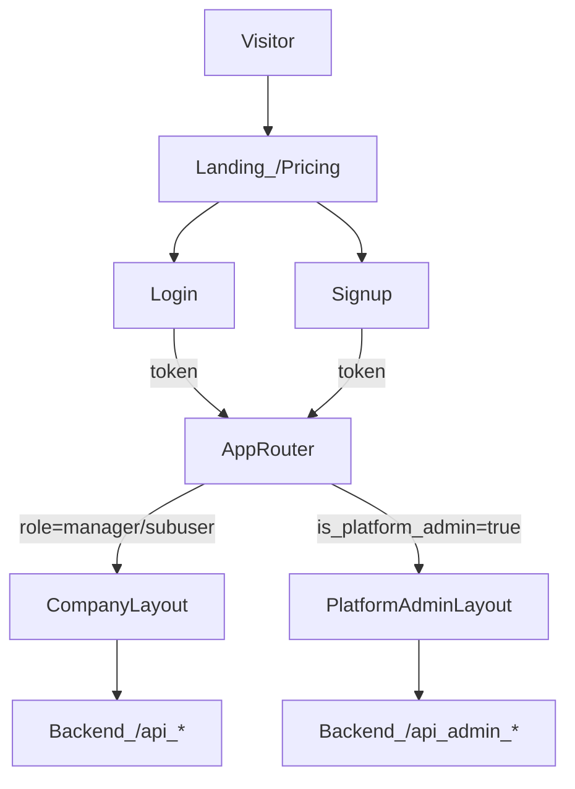

# Goals

- Create a **modern, minimal, hyper-usable Tabler UI** in React using **Vite + React Router**.
- Provide **two distinct dashboards**:
  - **Company dashboard**: for managers and employees; **employee (`subuser`) = print operations only**.
  - **Platform admin dashboard**: for you (`is_platform_admin=true`) exposing all admin/backend features, using a **sidebar menu** (not Tabler’s overlap/top nav).
- Include **Landing**, **Login**, **Signup**, and **Pricing/Plans** (driven by backend `/api/billing/plans`).
- Before building the UI, **verify all backend routes/APIs work** end-to-end.

# What exists (backend contract summary)

Backend is Sanic with bearer-session auth (`Authorization: Bearer <token>`). Key modules:

- Auth: `picanut/backend/app/routes/auth.py`
  - `POST /api/auth/login`, `POST /api/auth/signup`, `POST /api/auth/logout`, `GET /api/auth/me`
- Products & tags: `picanut/backend/app/routes/products.py`
  - Tags: `GET/POST /api/tags`, `PUT/DELETE /api/tags/:tag_id`
  - Products: `GET/POST /api/products`, `GET/PUT/DELETE /api/products/:product_id`
  - Variants: `POST /api/products/:product_id/variants`, `PUT/DELETE /api/variants/:variant_id`
- Printing & Woo orders: `picanut/backend/app/routes/print_jobs.py` plus print dispatch in `picanut/backend/app/main.py`
  - `POST /api/print/render` (returns `application/octet-stream`, header `X-Job-Id`)
  - `POST /api/print/:job_id/confirm`
  - `GET /api/print/jobs?limit=&status=`
  - `GET /api/print/orders/pending`
  - `POST /api/print/orders/:order_id/print-all` (returns bytes, header `X-Job-Ids`)
  - `POST /api/print/dispatch` (bytes body, uses `X-Agent-Id` / `X-Printer-Name` headers)
  - `GET /api/printers` (agent mediated)
- Agents (manager-only): `picanut/backend/app/routes/agents.py`
  - `GET/POST /api/agents`
  - `GET/PUT/DELETE /api/agents/:agent_id`
  - `POST /api/agents/:agent_id/regenerate-token`
  - `POST /api/agents/:agent_id/set-default`
  - `PUT /api/agents/:agent_id/access` and `DELETE /api/agents/:agent_id/access/:user_id` (UI only for now; backend doesn’t enforce it yet)
- Company settings/users (manager-only): `picanut/backend/app/routes/settings.py`
  - `GET/POST /api/settings/users`
  - `GET /api/settings/user`
  - `PUT /api/settings/user/default-agent`
  - `POST /api/settings/revoke-sessions`
- Billing: `picanut/backend/app/routes/billing.py`
  - Public: `GET /api/billing/plans`
  - Authed: `GET /api/billing/status`, `POST /api/billing/checkout`, `POST /api/billing/portal`
  - Webhook: `POST /api/billing/webhook` (Stripe signature verified)
- Platform admin (platform-admin-only): `picanut/backend/app/routes/admin.py`
  - Plans CRUD: `GET/POST /api/admin/plans`, `PUT/DELETE /api/admin/plans/:plan_id`
  - Orgs: `GET /api/admin/organizations`, `GET/PUT /api/admin/organizations/:org_id`

# Frontend structure decision

- Create `**picanut/frontend/`** (Vite).
- Configure Vite build output to `**picanut/backend/dist/`** (matches backend `DIST_DIR` in `picanut/backend/app/config.py`).
- Dev mode: run Vite dev server and proxy API calls to the backend.

# Backend verification (done before UI coding)

Create a small **API smoke-test script** (no backend changes required) that:

- Boots a local Postgres + backend (using your existing deployment approach if present; otherwise minimal local run).
- Runs through:
  - **Auth**: signup → me → logout → unauthorized checks; login as default admin.
  - **RBAC**: confirm manager-only endpoints reject subuser with 403 (agents/settings users); platform-only endpoints reject non-platform users.
  - **Products**: create tag/product/variant; list & search; update & delete; limit-hit behavior returns 402 with `limit_hit`.
  - **Printing**: `POST /api/print/render` returns bytes + `X-Job-Id`; confirm job; list jobs.
  - **Orders**: pending orders endpoint returns shape including `jobs`, `unmatched`.
  - **Billing**: public plans list; status; checkout/portal return URLs (can be mocked if Stripe keys absent).
- Output a clear pass/fail report and captures example JSON payloads (used to type the frontend API client).

# UI architecture (React + Router + Tabler)

- **Routing** (React Router):
  - Public: `/` (landing), `/pricing`, `/login`, `/signup`.
  - App entry: `/app/`*.
  - Company dashboard layout:
    - Managers: Tabler “overlap/top” style navigation.
    - Subusers: simplified nav (print-centric).
  - Platform admin layout: `/admin/`* uses **sidebar** menu layout.
- **Auth & guards**:
  - Central auth store (token + `GET /api/auth/me` bootstrap).
  - Route guards:
    - `RequireAuth` for `/app/`* and `/admin/`*.
    - `RequirePlatformAdmin` for `/admin/`*.
    - Company section shows/hides manager-only pages based on `role`.
- **Security posture in SPA** (within the constraints of bearer tokens):
  - Prefer **in-memory token** with optional `sessionStorage` fallback (no `localStorage` by default) to reduce persistence risk.
  - Strictly avoid `dangerouslySetInnerHTML`.
  - Centralized fetch client with:
    - base URL, `Authorization` injection, JSON vs binary handling,
    - consistent error mapping (401 → logout, 402 → upgrade CTA, 403 → permission UI),
    - request timeouts + abort.
  - Plan a follow-up hardening step to tighten backend CORS (`origins="*"` in `picanut/backend/app/main.py`) and add CSP/security headers (optional but recommended).

# UX: pages to implement (mapped to backend)

- Landing + Pricing
  - Pricing reads `/api/billing/plans` and renders a clean Tabler pricing grid + CTA.
- Auth
  - Login (`/api/auth/login`) and Signup (`/api/auth/signup`).
- Company dashboard
  - Home: quick actions + usage summary (`GET /api/billing/status`) + pending orders (`GET /api/print/orders/pending`).
  - Print queue: jobs list (`GET /api/print/jobs`).
  - Orders: pending orders detail + “print all” (`POST /api/print/orders/:id/print-all`).
  - Products (view-only for subuser): list/search/filter by tag (`GET /api/products`, `GET /api/tags`).
  - Manager-only:
    - Product editor (products/variants/tags CRUD).
    - Agents (CRUD, default, regenerate token, printer selection via `GET /api/printers`).
    - User accounts (`/api/settings/users`) + revoke sessions.
    - Billing page (status + checkout + portal).
- Platform admin dashboard (sidebar)
  - Plans (full CRUD) from `/api/admin/plans`.
  - Organizations list/detail + change plan/status from `/api/admin/organizations`*.
  - (Optional) “Impersonation” is **not** in backend; we’ll not invent it.

# Key files we will add/change

- New frontend app under:
  - `picanut/frontend/package.json`, `picanut/frontend/vite.config.ts`, `picanut/frontend/index.html`, `picanut/frontend/src/`**
- Backend build output directory used by server:
  - `picanut/backend/dist/`** (generated by build)
- Optional (recommended) backend hardening later:
  - `picanut/backend/app/main.py` (tighten CORS, add security headers)

